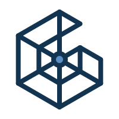
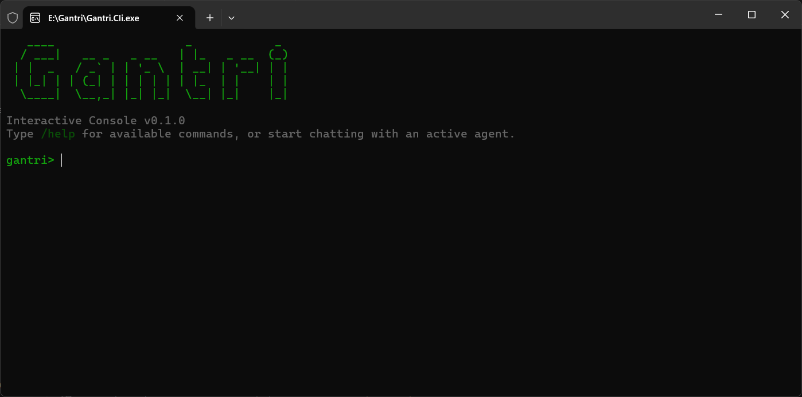
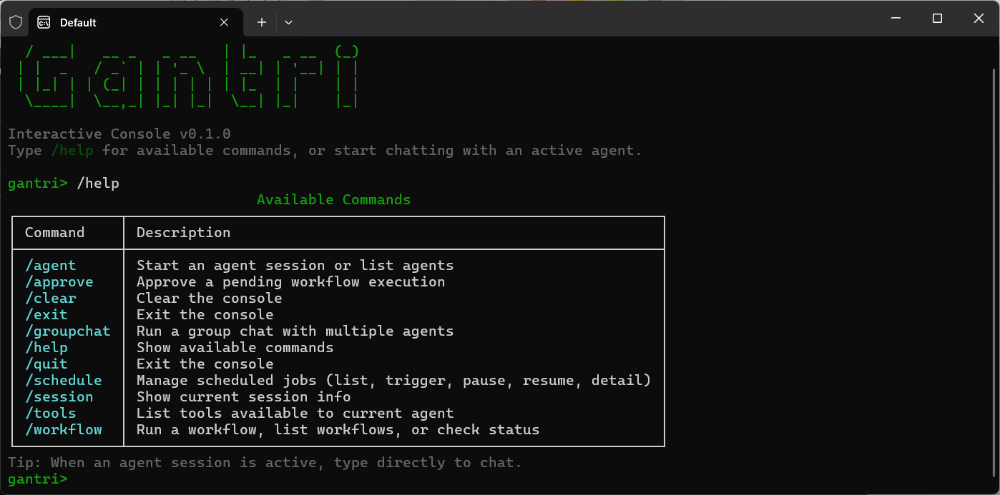
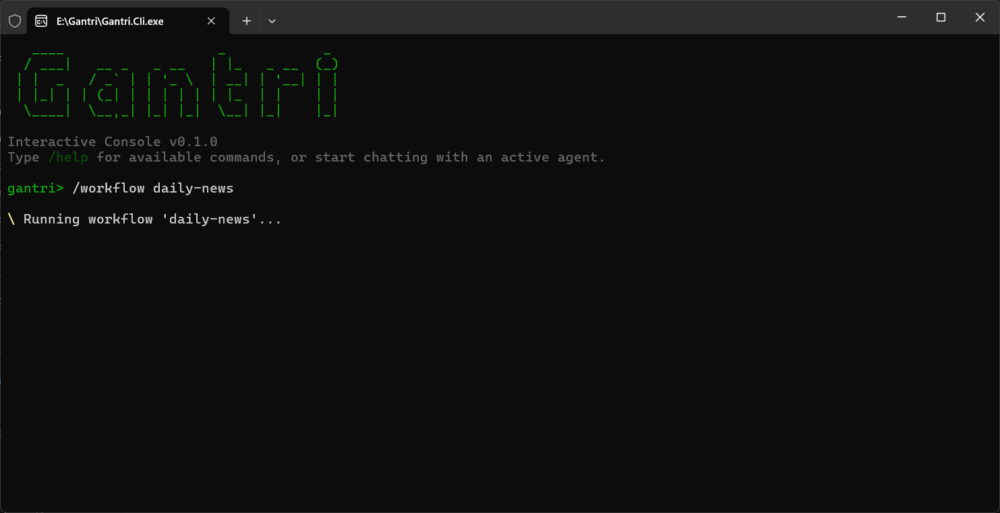
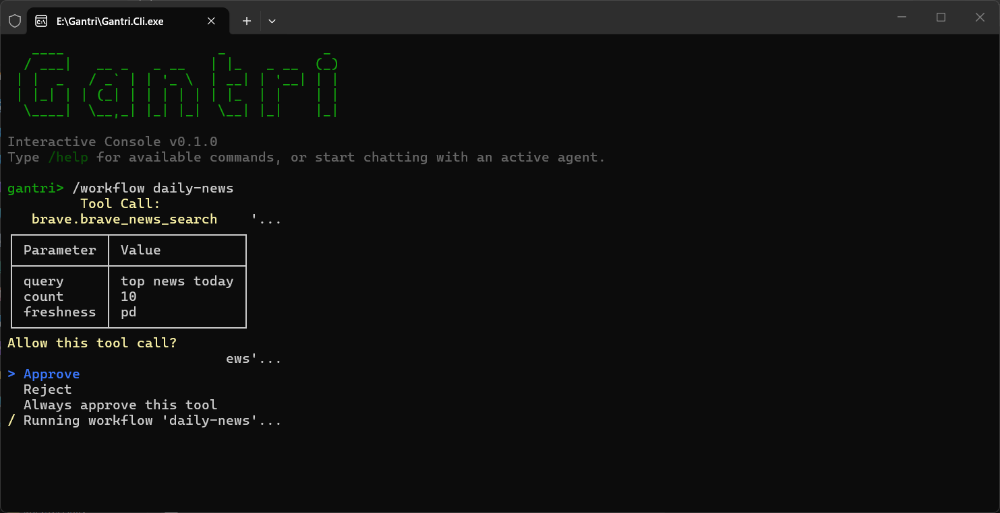
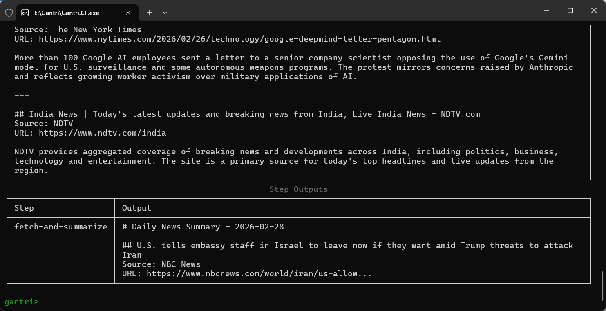
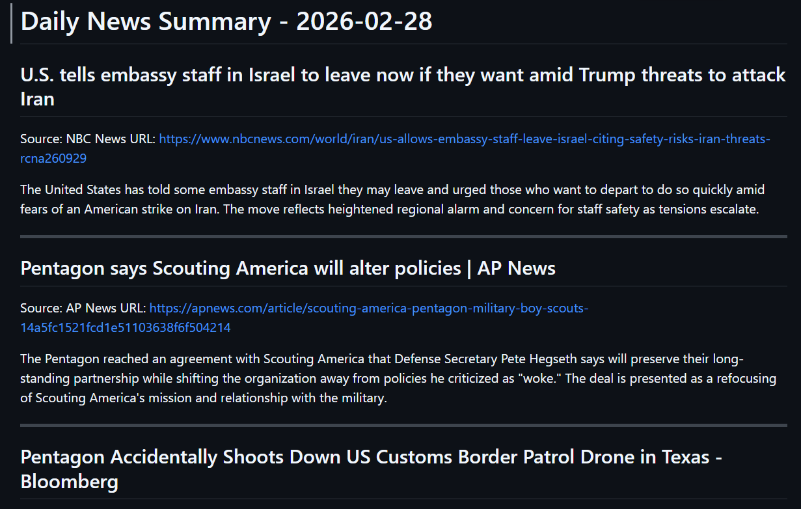
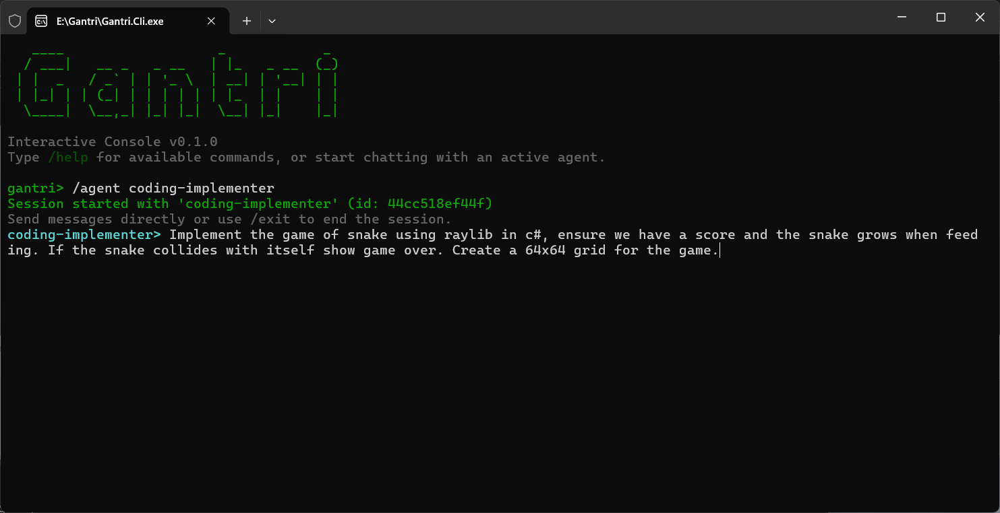
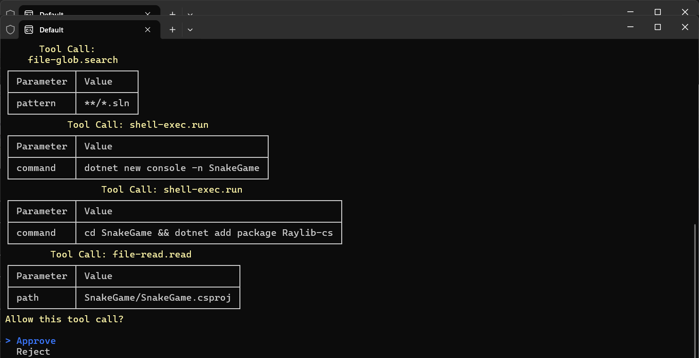
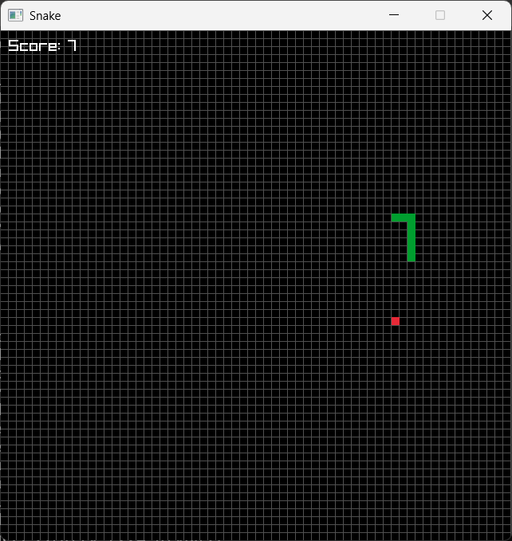

<p align="center">
  
</p>

<h1 align="center">Gantri</h1>

> [!WARNING]
> **This project is a prototype under heavy development.** Not all features are fully implemented or tested. Use at your own risk.

A modular, extensible C# agent framework for building AI-powered applications with plugin support, tool integration, and observable execution pipelines.

Built on .NET 10, Microsoft Agent Framework, Microsoft.Extensions.AI, Azure OpenAI, Spectre.Console, and OpenTelemetry.


<a href="https://www.buymeacoffee.com/joshuavarley" target="_blank"></a>


## Features

- **Agent Framework integration** — Agents run on the Microsoft Agent Framework (`AIAgent`, `AgentSession`), with a bridge layer that adapts Gantri's plugin/hook/MCP systems to AF's APIs. `IAgentProvider` exposes raw `AIAgent` instances for protocol-aware hosts (AG-UI, A2A).
- **Multi-agent orchestration** — `AfAgentOrchestrator.RunGroupChatAsync` uses AF's native `AgentWorkflowBuilder` group chat with `RoundRobinGroupChatManager` for shared conversation history, iterative multi-round refinement, and configurable iteration counts via `InProcessExecution`.
- **AG-UI and A2A protocol hosting** — Web host exposes agents as AG-UI SSE endpoints for web frontends (CopilotKit, custom UIs) and A2A endpoints for agent-to-agent discovery and communication via AgentCards.
- **Dual plugin system** — Native .NET plugins loaded via isolated `AssemblyLoadContext`, plus WASM sandboxed plugins via Wasmtime for language-agnostic extensions.
- **Workflow engine** — Define multi-step workflows in YAML with agent, plugin, condition, approval, and parallel step types. Simple sequential agent workflows route through AF; complex workflows use the legacy engine.
- **Job scheduling** — Cron-based scheduling built on TickerQ that triggers workflows, agents, or plugins on a schedule, with a dedicated Worker host for background execution.
- **Hook pipeline** — Cross-cutting middleware with pattern-matched event hooks (`Before`, `After`, `OnError`, `Around`) for every subsystem.
- **MCP integration** — Connect to external Model Context Protocol servers to expose tools to agents. MCP servers auto-connect on first use with a 30-second timeout, with per-agent server permissions.
- **Plugin services** — Framework-level `IPluginServices` provides plugins with access to logging, configuration, AI chat clients, and shared external services via `GetService<T>()`. Backed by the host's DI container.
- **Shared connection providers** — Generic `IConnectionProvider` / `IServiceConnection` abstractions for managing pooled connections to external services. Plugins resolve typed providers (e.g., `IDataverseConnectionProvider`) through `context.Services.GetService<T>()`.
- **Dataverse integration** — Built-in connection provider for Microsoft Dataverse (D365/Power Platform) with support for multiple named profiles, connection pooling, and five authentication types (client secret, device code, interactive browser, Azure CLI, certificate). CLI commands for profile management (`gantri plugin dataverse profiles/switch/test/current`).
- **YAML configuration** — All settings, agent definitions, plugin directories, and hook bindings configured from YAML files with environment variable substitution.
- **OpenTelemetry instrumentation** — Built-in `ActivitySource` and `Meter` instances for traces, metrics, and logs across all subsystems.
- **Interactive console** — Launch `gantri` with no arguments to enter a persistent REPL with `/commands` for agents, workflows, group chat, and more. Streaming agent responses render tokens in real time. Human-in-the-loop tool approval prompts before any plugin/MCP tool executes. Workflow approval steps prompt inline instead of pausing to disk.
- **CLI interface** — Spectre.Console-powered CLI for running agents, executing workflows, orchestrating group chats, viewing schedules, listing plugins, and managing configuration.

## Screenshots

### Interactive Console

<p align="center">
  
</p>

<p align="center">
  
</p>

### Workflow Execution

<p align="center">
  
</p>

<p align="center">
  
</p>

<p align="center">
  
</p>

### Daily News Workflow Output

<p align="center">
  
</p>


### Coding Agent in Action

<p align="center">
  
</p>

<p align="center">
  
</p>

<p align="center">
  
</p>


## Getting Started

- Clone the repo and run `dotnet build Gantri.slnx`
- Copy `.env.example` to `.env` and set your `AZURE_OPENAI_API_KEY`
- Update `config/ai.yaml` with your Azure OpenAI endpoint and model deployment names
- Node.js 18+ required if using MCP servers (a Brave Search example is included)
- Run tests: `dotnet test Gantri.slnx`
- Launch interactive REPL: `dotnet run --project src/Hosts/Gantri.Cli`
- Start background scheduler: `dotnet run --project src/Hosts/Gantri.Worker`
- Start web host (AG-UI + A2A): `dotnet run --project src/Hosts/Gantri.Web`

## Pre-Built Agents

Gantri ships with several agent definitions in `config/agents/`:

| Agent | Description | Tools |
|-------|-------------|-------|
| `news-summarizer` | Fetches and summarizes daily news | Brave MCP (search), file-save plugin |
| `content-writer` | Drafts well-structured markdown content | file-save plugin |
| `fact-checker` | Reviews content for factual accuracy | None |
| `editor` | Polishes grammar, clarity, and tone | None |
| `file-search` | Searches files using glob patterns | file-glob plugin |
| `coding-planner` | Analyzes requirements and produces implementation plans | file-read, file-glob, directory-list, project-detect |
| `coding-implementer` | Implements code changes following a plan | file-read, file-save, file-edit, file-glob, file-delete, directory-list, shell-exec |
| `coding-tester` | Runs tests, analyzes failures, writes new tests | file-read, file-save, file-edit, file-glob, shell-exec, directory-list |
| `coding-reviewer` | Reviews changes for correctness and security | file-read, file-glob, directory-list, git-operations |
| `coding-debugger` | Reproduces errors, traces root causes, applies fixes | file-read, file-glob, file-edit, shell-exec, directory-list, git-operations |

## Pre-Built Workflows

| Workflow | Description | Steps |
|----------|-------------|-------|
| `daily-news` | Fetches and saves a daily news summary | 1 agent step (news-summarizer) |
| `content-review` | Multi-agent content review pipeline | Draft -> Parallel(grammar + fact-check) -> Final edit -> Approval gate |
| `code-implement` | End-to-end feature development | Plan -> Implement -> Test -> Review |
| `code-debug` | Debug an issue and verify the fix | Debug -> Test -> Review |
| `code-review` | Review uncommitted code changes | Single-step review |
| `code-test` | Analyze coverage and write tests | Analyze -> Write tests |

## Built-in Plugins

Gantri ships with 12 built-in plugins in `plugins/built-in/`:

| Plugin | Actions | Capabilities | Description |
|--------|---------|-------------|-------------|
| `file-read` | `read` | FsRead | Read file contents with line numbers, offset/limit |
| `file-save` | `save` | FsWrite | Write content to a file |
| `file-edit` | `search-replace`, `insert` | FsRead, FsWrite | Search-replace and line insertion |
| `file-delete` | `delete` | FsWrite | Delete a file |
| `file-glob` | `search` | FsRead | Glob pattern file search with optional text matching |
| `directory-list` | `tree` | FsRead | Tree-formatted directory listing |
| `shell-exec` | `run` | ProcessExec | Execute shell commands with allowlist |
| `git-operations` | `status`, `diff`, `log`, `commit` | ProcessExec, FsRead | Git version control operations |
| `project-detect` | `analyze` | FsRead | Detect project language/framework/tooling |
| `web-fetch` | `fetch` | HttpRequest | Fetch web URLs with HTML stripping |
| `dataverse-tools` | `who-am-i`, `list-entities`, `query-records` | HttpRequest | Dataverse environment tools via shared connection provider |
| `hello-world` | `hello` | — | Test/example plugin |

## Dataverse Connection Management

Configure Dataverse environments in `config/dataverse.yaml`:

```yaml
dataverse:
  active_profile: dev
  profiles:
    dev:
      name: dev
      url: https://org-dev.crm.dynamics.com
      auth_type: device_code
      tenant_id: ${AZURE_TENANT_ID}
    prod:
      name: prod
      url: https://org-prod.crm.dynamics.com
      auth_type: client_secret
      tenant_id: ${AZURE_TENANT_ID}
      client_id: ${DATAVERSE_CLIENT_ID}
      credential: ${DATAVERSE_CLIENT_SECRET}
```

Supported auth types: `client_secret`, `device_code`, `interactive`, `azure_cli`, `certificate`.

CLI commands:

```
gantri plugin dataverse profiles      # List all configured profiles
gantri plugin dataverse switch <name> # Switch active profile
gantri plugin dataverse test [name]   # Test a connection
gantri plugin dataverse current       # Show active profile
```

Plugins access Dataverse through the shared connection provider:

```csharp
var provider = context.Services?.GetService<IDataverseConnectionProvider>();
var conn = await provider.GetActiveConnectionAsync(ct);
```

## Architecture

For detailed technical documentation including the layered architecture diagram (with Mermaid visualization), bridge layer internals, AG-UI/A2A hosting, CLI command reference, configuration reference, security model, workflow engine, plugin development guide, hook system, telemetry, and programmatic usage, see [Architecture.md](Architecture.md).

## Project Status

Gantri is under active development. The following phases are complete:

- [x] **Phase 0** — Solution scaffolding and abstractions
- [x] **Phase 1** — Telemetry foundation
- [x] **Phase 2** — Hook pipeline engine
- [x] **Phase 3** — Plugin SDK and native plugin loader
- [x] **Phase 4** — Unified plugin router
- [x] **Phase 5** — AI provider abstraction
- [x] **Phase 6** — YAML configuration loading
- [x] **Phase 7** — MCP client integration
- [x] **Phase 8** — Agent framework
- [x] **Phase 9** — CLI host and Azure OpenAI wiring (MVP)
- [x] **Phase 10** — WASM plugin loader (Wasmtime)
- [x] **Phase 11** — Workflow engine (agent, plugin, condition, parallel steps)
- [x] **Phase 12** — Job scheduling (TickerQ-backed cron/time scheduling)
- [x] **Phase 13** — Worker host (background service)
- [x] **Phase 14** — CLI polish (workflow, schedule, and config validate commands)
- [x] **Phase 15** — Integration testing and hardening
- [x] **Phase 16** — Agent tool calling (MCP auto-connect, working directory, parameter normalization)
- [x] **Phase 17** — Microsoft Agent Framework integration (Bridge layer, AF agents, AF native group chat workflows with `RoundRobinGroupChatManager`, dual-mode workflow engine)
- [x] **Phase 18** — Interactive console with slash commands, streaming agent responses, human-in-the-loop tool approval, and inline workflow approval
- [x] **Phase 19** — Agentic coding (coding plugins, agents, and workflows)
- [x] **Phase 20** — AG-UI + A2A protocol hosting (Web host, IAgentProvider, MapAGUI/MapA2A endpoints)
- [x] **Phase 21** — Shared connection providers and Dataverse integration (IPluginServices promotion, generic IConnectionProvider/IServiceConnection abstractions, Dataverse SDK with connection pooling and multi-profile auth, dataverse-tools plugin, CLI connection management commands)

**Test coverage:** Comprehensive unit and integration test suites are included across core, domain, bridge, and host-facing paths.

## License

This project is licensed under the Business Source License 1.1 (BSL 1.1).
